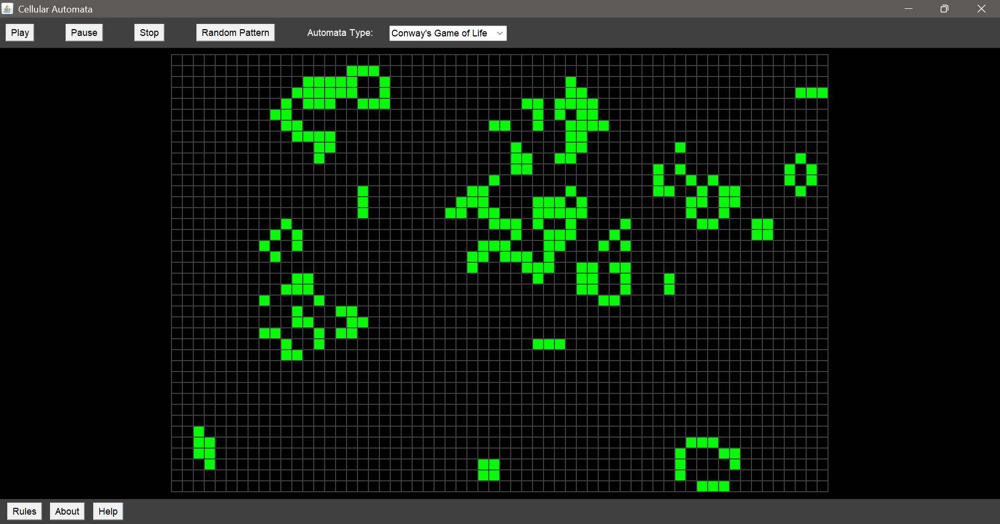

## Cellular Automation with JAVA: Showing Conway's Game of Life and other Automata

This is a small, interactive playground for cellular automata. Think of a grid of tiny cells that live, die, and evolve over time (generations) based on simple rules. Simple rules give unique ways in which cells behave throughout generations which is what makes this fascinating for biologists, physicists etc.

### Why Conway’s Game of Life?
Conway’s Game of Life is a classic: each cell is either alive or dead, and what happens next depends on its neighbors. It’s simple to explain, yet it generates patterns that move, replicate, and suprises you!

Quick rules:
- A live cell with fewer than 2 live neighbors dies (underpopulation)
- A live cell with 2 or 3 live neighbors lives on
- A live cell with more than 3 neighbors dies (overpopulation)
- A dead cell with exactly 3 live neighbors becomes alive (reproduction)

## Files

- `CellAutomata.java`: starts the app and creates the window
- `CAframe` (inside `CellAutomata.java`): draws the grid and the buttons
- `GridControl.java`: connects the buttons to the simulation and updates the grid
- `Automata.java`: a tiny interface that defines “how to evolve” and “how to explain the rules”
- `ConwayGame.java`: one concrete set of rules (Conway’s)

## Requirements

- Java JDK 8+ (any recent JDK works)

## Run it

```bash
javac *.java
java CellAutomata
```

Or, if you like a separate output directory:

```bash
javac -d out *.java
java -cp out CellAutomata
```

## How to Use it?

- Click cells to toggle alive/dead
- Play to animate, Pause to stop temporarily, Stop to reset
- Random Pattern gives you a random starting point
- The dropdown lets you pick the automaton
- “Rules” shows a description of the current automaton

## Make your own automaton

We can utilize the OOP concept in JAVA by having you contribute to this project. Right now, we have only Conway's Game of Life, but there exists multiple automata. Here's how to add your own automata, to create a playground of different types of automation.

1) Create a class that implements `Automata`.

```java
public class BriansBrain implements Automata {
    @Override
    public void nextGeneration(boolean[][] cells) {
        // your evolution logic here
    }

    @Override
    public String getRulesDescription() {
        return "Brian's Brain rules...";
    }
}
```

2) Tell the UI about it:
   - Add your label (e.g., "Brian's Brain") to the `Choice` in `CAframe`
   - In `GridControl`, in the dropdown handler, map that label to `setAutomaton(new BriansBrain())`

3) Recompile and run

Fork this repo, add your automaton class, wire it up, and open a PR with a short description and a screenshot. Let's learn together.

 ## UI
 
 
